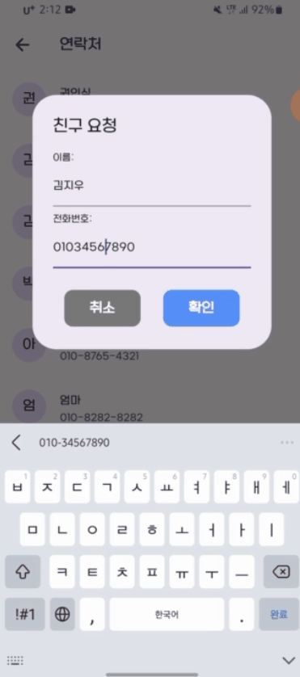
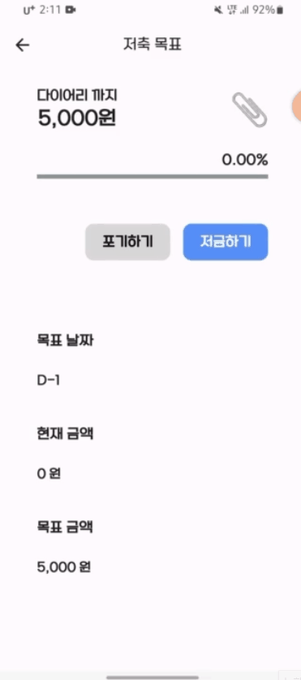
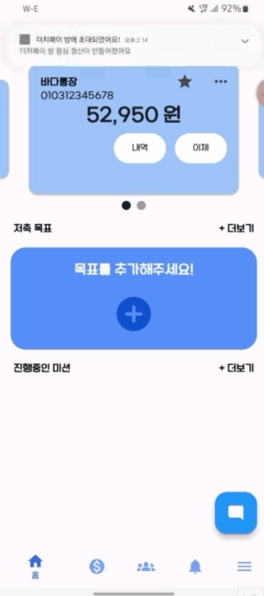

# 🐳 WhaleBank: W-E


#### 10대 청소년을 위한 금융 관리 앱

</br>

## 🕞 프로젝트 진행 기간
**2024.02.26 ~ 2024.04.04** (6주)

<br>

# 🐋 W-E
10대들의 금융 이해력이 낮다는 기사를 접한 적이 있으신가요?
전문가들은 입을 모아 금융 교육의 필요성을 강조하고 있습니다.

다소 딱딱하고 지루할 수 있는 자산 관리, 조금 더 **쉽게** 다가가겠습니다.
W-E와 함께 **자산 관리를 시작해볼까요?** 

고객님들의 첫 자산 관리 경험을 돕고, 앞으로 모든 금융 생활에 **Whale Bank**가 함께하겠습니다.

<br>

## 💬 주요 기능
1. 부모-아이 간 그룹을 생성하여, 부모가 아이에게 정기적으로 용돈을 자동이체할 수 있는 기능

2. 부모가 아이에게 보상 금액과 함께 미션을 제공, 성공 시 아이는 추가적인 용돈을 얻을 수 있는 기능

3. 아이가 부모에게 용돈 인상을 요청하고, 부모는 요청을 승인하거나 거절하여 용돈 금액을 협상할 수 있는 기능

4. 결제내역 선택 시 자동으로 정산 금액을 계산하여 이체하는 더치페이 기능

5. 아이가 저축 목표를 설정하고, 자율적으로 저금할 수 있는 기능

6. 은행 입금 내역과 카드 지출 내역을 연동한 가계부 기능과 월별 지출 내역의 통계를 제공

7. 단말기의 연락처에 저장된 전화번호를 기반으로 친구 요청을 보낼 수 있는 기능  

8. 챗봇을 제공하여 W-E 서비스와 금융 용어 관련된 질의응답을 할 수 있는 기능  


<br>

## 📱 서비스 화면

<br>



<br>


<br>

## 👩‍💻 개발 환경

<a name="item-three"></a>

|일정관리|형상관리|커뮤니케이션|디자인|
|:---:|:---:|:---:|:---:|
|  |  |  |  |


<br>


#### IDE

 

<br>


#### Frontend
 

<br>


#### Backend

  
    
  

<br>

#### Chat Bot
 


#### DevOPS

   

<br>

## 🏢 아키텍처


## 📂 프로젝트 파일 구조

<details>
<summary><b>FrontEnd</b></summary>

```
📦lib
 ┣ 📂api
 ┃ ┣ 📂account
 ┃ ┃ ┣ 📜account_list_api.dart
 ┃ ┃ ┣ 📜main_account.dart
 ┃ ┃ ┗ 📜transfer_api.dart
 ┃ ┣ 📂account_book
 ┃ ┃ ┣ 📜account_book_api.dart
 ┃ ┃ ┗ 📜account_book_model.dart
 ┃ ┣ 📂allowance
 ┃ ┃ ┣ 📜add_child_api.dart
 ┃ ┃ ┣ 📜allowance_patch_api.dart
 ┃ ┃ ┣ 📜children_api.dart
 ┃ ┃ ┗ 📜child_model.dart
 ┃ ┣ 📂mission
 ┃ ┃ ┣ 📜add_mission_api.dart
 ┃ ┃ ┗ 📜mission_list_api.dart
 ┃ ┣ 📂nego
 ┃ ┃ ┗ 📜nego_list_api.dart
 ┃ ┣ 📂save
 ┃ ┃ ┣ 📜goal_add_api.dart
 ┃ ┃ ┣ 📜goal_detail_api.dart
 ┃ ┃ ┗ 📜goal_list_api.dart
 ┃ ┣ 📂statistics
 ┃ ┃ ┗ 📜month_account_api.dart
 ┃ ┣ 📜base_url.dart
 ┃ ┗ 📜test_html.dart
 ┣ 📂models
 ┃ ┣ 📂account
 ┃ ┃ ┣ 📜account_list_data.dart
 ┃ ┃ ┣ 📜bank_code.dart
 ┃ ┃ ┣ 📜dummy_data_account.dart
 ┃ ┃ ┗ 📜transfer_data.dart
 ┃ ┣ 📂mission
 ┃ ┃ ┗ 📜mission_model.dart
 ┃ ┣ 📂save
 ┃ ┃ ┣ 📜goal_add.dart
 ┃ ┃ ┗ 📜goal_list.dart
 ┃ ┣ 📂statistics
 ┃ ┃ ┗ 📜account_month_model.dart
 ┃ ┣ 📂store
 ┃ ┃ ┣ 📂account
 ┃ ┃ ┃ ┗ 📜account_controller.dart
 ┃ ┃ ┣ 📂saving_goal
 ┃ ┃ ┃ ┗ 📜goal_list_controller.dart
 ┃ ┃ ┣ 📂user
 ┃ ┃ ┃ ┣ 📜user.dart
 ┃ ┃ ┃ ┗ 📜user_controller.dart
 ┃ ┃ ┗ 📂userRole
 ┃ ┃ ┃ ┗ 📜user_role.dart
 ┃ ┣ 📜mission_data.dart
 ┃ ┗ 📜signup_request.dart
 ┣ 📂screens
 ┃ ┣ 📂account_book
 ┃ ┃ ┣ 📂widgets
 ┃ ┃ ┃ ┣ 📜chart.dart
 ┃ ┃ ┃ ┣ 📜chart2.dart
 ┃ ┃ ┃ ┣ 📜table.dart
 ┃ ┃ ┃ ┗ 📜table_card.dart
 ┃ ┃ ┣ 📜account_book_home_page.dart
 ┃ ┃ ┗ 📜form_account_book.dart
 ┃ ┣ 📂bank_history_page
 ┃ ┃ ┣ 📂widgets
 ┃ ┃ ┃ ┣ 📜bank_history_card.dart
 ┃ ┃ ┃ ┣ 📜bank_history_table.dart
 ┃ ┃ ┃ ┣ 📜bank_top_container.dart
 ┃ ┃ ┃ ┗ 📜trans_type_button.dart
 ┃ ┃ ┗ 📜bank_history_page.dart
 ┃ ┣ 📂chat_page
 ┃ ┃ ┗ 📜chat_page.dart
 ┃ ┣ 📂child_page
 ┃ ┃ ┣ 📂widgets
 ┃ ┃ ┃ ┣ 📜goal_card.dart
 ┃ ┃ ┃ ┣ 📜goal_section_bar.dart
 ┃ ┃ ┃ ┣ 📜mission_list.dart
 ┃ ┃ ┃ ┗ 📜mission_section_bar.dart
 ┃ ┃ ┣ 📜child_home_page.dart
 ┃ ┃ ┗ 📜child_page.dart
 ┃ ┣ 📂dutchpay_page
 ┃ ┃ ┣ 📂widgets
 ┃ ┃ ┃ ┣ 📜create_room.dart
 ┃ ┃ ┃ ┣ 📜dutchpay_detail_page.dart
 ┃ ┃ ┃ ┣ 📜dutchpay_my_payment_page.dart
 ┃ ┃ ┃ ┗ 📜dutchpay_payment_page.dart
 ┃ ┃ ┗ 📜dutchpay_page.dart
 ┃ ┣ 📂friends_page
 ┃ ┃ ┣ 📂widgets
 ┃ ┃ ┃ ┣ 📜change_nickname_friends.dart
 ┃ ┃ ┃ ┣ 📜contacts_modal.dart
 ┃ ┃ ┃ ┣ 📜friends.dart
 ┃ ┃ ┃ ┗ 📜friends_request_modal.dart
 ┃ ┃ ┗ 📜my_friends_page.dart
 ┃ ┣ 📂mission_page
 ┃ ┃ ┣ 📂widgets
 ┃ ┃ ┃ ┣ 📜mission.dart
 ┃ ┃ ┃ ┗ 📜mission_none.dart
 ┃ ┃ ┗ 📜my_mission_page.dart
 ┃ ┣ 📂parents_page
 ┃ ┃ ┣ 📂children_page
 ┃ ┃ ┃ ┣ 📂widgets
 ┃ ┃ ┃ ┃ ┣ 📂mission
 ┃ ┃ ┃ ┃ ┃ ┣ 📜mission_add_card.dart
 ┃ ┃ ┃ ┃ ┃ ┣ 📜mission_card.dart
 ┃ ┃ ┃ ┃ ┃ ┗ 📜mission_list.dart
 ┃ ┃ ┃ ┃ ┗ 📜add_child_form.dart
 ┃ ┃ ┃ ┣ 📜children_carousel.dart
 ┃ ┃ ┃ ┗ 📜child_info.dart
 ┃ ┃ ┣ 📂widgets
 ┃ ┃ ┃ ┣ 📂nego
 ┃ ┃ ┃ ┃ ┣ 📜nego_card.dart
 ┃ ┃ ┃ ┃ ┣ 📜nego_detail_page.dart
 ┃ ┃ ┃ ┃ ┗ 📜nego_list_widget.dart
 ┃ ┃ ┃ ┣ 📜allowance_info_form.dart
 ┃ ┃ ┃ ┣ 📜children_list.dart
 ┃ ┃ ┃ ┣ 📜child_card.dart
 ┃ ┃ ┃ ┗ 📜section_bar.dart
 ┃ ┃ ┣ 📜parent_home_page.dart
 ┃ ┃ ┗ 📜parent_page.dart
 ┃ ┣ 📂profile_page
 ┃ ┃ ┗ 📜my_profile_page.dart
 ┃ ┣ 📂salary_page
 ┃ ┃ ┣ 📂widgets
 ┃ ┃ ┃ ┣ 📜change_nickname_parents.dart
 ┃ ┃ ┃ ┗ 📜salary.dart
 ┃ ┃ ┣ 📜salary_increase_form_page.dart
 ┃ ┃ ┣ 📜salary_increase_page.dart
 ┃ ┃ ┗ 📜salary_list_page.dart
 ┃ ┣ 📂saving_goal_page
 ┃ ┃ ┣ 📂widgets
 ┃ ┃ ┃ ┣ 📜saving_goal.dart
 ┃ ┃ ┃ ┣ 📜saving_goal_account_carousel.dart
 ┃ ┃ ┃ ┣ 📜saving_goal_detail.dart
 ┃ ┃ ┃ ┣ 📜saving_goal_none.dart
 ┃ ┃ ┃ ┣ 📜saving_goal_none_noadd.dart
 ┃ ┃ ┃ ┗ 📜saving_goal_plus.dart
 ┃ ┃ ┣ 📜goal_add_form(no use).dart
 ┃ ┃ ┣ 📜my_saving_goal_form.dart
 ┃ ┃ ┗ 📜my_saving_goal_page.dart
 ┃ ┣ 📂transfer_page
 ┃ ┃ ┣ 📂widgets
 ┃ ┃ ┃ ┣ 📜bank_code_button.dart
 ┃ ┃ ┃ ┣ 📜input_format.dart
 ┃ ┃ ┃ ┗ 📜transfet_password_form.dart
 ┃ ┃ ┣ 📜gruop_transfer_page.dart
 ┃ ┃ ┗ 📜transfer_page.dart
 ┃ ┣ 📜alarm_page.dart
 ┃ ┣ 📜login_page.dart
 ┃ ┣ 📜menu_page.dart
 ┃ ┣ 📜my_home_page.dart
 ┃ ┣ 📜pin_login_page.dart
 ┃ ┣ 📜pin_setting_page.dart
 ┃ ┣ 📜signup_page.dart
 ┃ ┗ 📜TODO.md
 ┣ 📂services
 ┃ ┣ 📜auth_interceptor.dart
 ┃ ┣ 📜auth_service.dart
 ┃ ┗ 📜dio_service.dart
 ┣ 📂widgets
 ┃ ┣ 📜bank_book.dart
 ┃ ┣ 📜bank_detail.dart
 ┃ ┣ 📜carousel_with_indicator.dart
 ┃ ┣ 📜my_img.dart
 ┃ ┣ 📜nav_bar.dart
 ┃ ┣ 📜pin_money.dart
 ┃ ┗ 📜TODO.md
 ┣ 📜firebase_options.dart
 ┗ 📜main.dart
```

</details>

<details>
<summary><b>BackEnd</b></summary>

```
📦backend
 ┣ 📂domain
 ┃ ┣ 📂account
 ┃ ┃ ┣ 📂controller
 ┃ ┃ ┃ ┗ 📜AccountController.java
 ┃ ┃ ┣ 📂dto
 ┃ ┃ ┃ ┣ 📂request
 ┃ ┃ ┃ ┃ ┣ 📜InquiryRequestDto.java
 ┃ ┃ ┃ ┃ ┣ 📜TransactionHistoryRequestDto.java
 ┃ ┃ ┃ ┃ ┗ 📜WithdrawRequestDto.java
 ┃ ┃ ┃ ┗ 📂response
 ┃ ┃ ┃ ┃ ┣ 📜AccountDetailResponseDto.java
 ┃ ┃ ┃ ┃ ┣ 📜AccountInfoResponseDto.java
 ┃ ┃ ┃ ┃ ┣ 📜InquiryResponseDto.java
 ┃ ┃ ┃ ┃ ┗ 📜TransactionHistoryResponseDto.java
 ┃ ┃ ┗ 📂service
 ┃ ┃ ┃ ┣ 📜AccountService.java
 ┃ ┃ ┃ ┗ 📜AccountServiceImpl.java
 ┃ ┣ 📂accountbook
 ┃ ┃ ┣ 📂controller
 ┃ ┃ ┃ ┗ 📜AccountBookController.java
 ┃ ┃ ┣ 📂dto
 ┃ ┃ ┃ ┣ 📂request
 ┃ ┃ ┃ ┃ ┗ 📜AccountBookEntryRequestDto.java
 ┃ ┃ ┃ ┗ 📂response
 ┃ ┃ ┃ ┃ ┣ 📜AccountBookEntryResponseDto.java
 ┃ ┃ ┃ ┃ ┗ 📜MonthlyHistoryResponseDto.java
 ┃ ┃ ┣ 📂repository
 ┃ ┃ ┃ ┣ 📜AccountBookBulkRepository.java
 ┃ ┃ ┃ ┗ 📜AccountBookRepository.java
 ┃ ┃ ┣ 📂service
 ┃ ┃ ┃ ┣ 📜AccountBookService.java
 ┃ ┃ ┃ ┗ 📜AccountBookServiceImpl.java
 ┃ ┃ ┗ 📜AccountBookEntity.java
 ┃ ┣ 📂allowance
 ┃ ┃ ┣ 📂controller
 ┃ ┃ ┃ ┗ 📜AllowanceController.java
 ┃ ┃ ┣ 📂dto
 ┃ ┃ ┃ ┣ 📂request
 ┃ ┃ ┃ ┃ ┣ 📜AddGroupRequestDto.java
 ┃ ┃ ┃ ┃ ┣ 📜UpdateAllowanceRequestDto.java
 ┃ ┃ ┃ ┃ ┗ 📜UpdateNicknameRequestDto.java
 ┃ ┃ ┃ ┗ 📂response
 ┃ ┃ ┃ ┃ ┣ 📜AllowanceInfoResponseDto.java
 ┃ ┃ ┃ ┃ ┣ 📜ChildrenDetailResponseDto.java
 ┃ ┃ ┃ ┃ ┣ 📜ChildrenInfoResponseDto.java
 ┃ ┃ ┃ ┃ ┗ 📜GroupInfoResponseDto.java
 ┃ ┃ ┣ 📂repository
 ┃ ┃ ┃ ┣ 📜AutoPaymentRepository.java
 ┃ ┃ ┃ ┣ 📜GroupRepository.java
 ┃ ┃ ┃ ┗ 📜RoleRepository.java
 ┃ ┃ ┣ 📂service
 ┃ ┃ ┃ ┣ 📜AllowanceService.java
 ┃ ┃ ┃ ┣ 📜AllowanceServiceImpl.java
 ┃ ┃ ┃ ┗ 📜AutoPaymentUtils.java
 ┃ ┃ ┣ 📜AutoPaymentEntity.java
 ┃ ┃ ┣ 📜GroupEntity.java
 ┃ ┃ ┗ 📜RoleEntity.java
 ┃ ┣ 📂dutchpay
 ┃ ┃ ┣ 📂controller
 ┃ ┃ ┃ ┗ 📜DutchpayController.java
 ┃ ┃ ┣ 📂dto
 ┃ ┃ ┃ ┣ 📂request
 ┃ ┃ ┃ ┃ ┣ 📜DutchpayRoomRequestDto.java
 ┃ ┃ ┃ ┃ ┣ 📜PaymentRequestDto.java
 ┃ ┃ ┃ ┃ ┣ 📜RegisterPaymentRequestDto.java
 ┃ ┃ ┃ ┃ ┗ 📜SelfDutchpayRequestDto.java
 ┃ ┃ ┃ ┗ 📂response
 ┃ ┃ ┃ ┃ ┣ 📜DutchpayDetailResponseDto.java
 ┃ ┃ ┃ ┃ ┣ 📜DutchpayRoomResponseDto.java
 ┃ ┃ ┃ ┃ ┗ 📜PaymentResponseDto.java
 ┃ ┃ ┣ 📂repository
 ┃ ┃ ┃ ┣ 📜CategoryCalculateRepository.java
 ┃ ┃ ┃ ┣ 📜DutchpayRepository.java
 ┃ ┃ ┃ ┣ 📜DutchpayRoomRepository.java
 ┃ ┃ ┃ ┗ 📜SelectedPaymentRepository.java
 ┃ ┃ ┣ 📂service
 ┃ ┃ ┃ ┣ 📜DutchpayService.java
 ┃ ┃ ┃ ┗ 📜DutchpayServiceImpl.java
 ┃ ┃ ┣ 📜CategoryCalculateEntity.java
 ┃ ┃ ┣ 📜DutchpayEntity.java
 ┃ ┃ ┣ 📜DutchpayRoomEntity.java
 ┃ ┃ ┗ 📜SelectedPaymentEntity.java
 ┃ ┣ 📂friend
 ┃ ┃ ┣ 📂controller
 ┃ ┃ ┃ ┗ 📜FriendController.java
 ┃ ┃ ┣ 📂dto
 ┃ ┃ ┃ ┣ 📂request
 ┃ ┃ ┃ ┃ ┣ 📜FriendManageRequestDto.java
 ┃ ┃ ┃ ┃ ┗ 📜UpdateFriendNicknameRequestDto.java
 ┃ ┃ ┃ ┗ 📂response
 ┃ ┃ ┃ ┃ ┣ 📜FriendManageResponseDto.java
 ┃ ┃ ┃ ┃ ┣ 📜FriendResponseDto.java
 ┃ ┃ ┃ ┃ ┣ 📜PendingRequestDto.java
 ┃ ┃ ┃ ┃ ┗ 📜UpdateFriendNicknameResponseDto.java
 ┃ ┃ ┣ 📂repository
 ┃ ┃ ┃ ┣ 📜FriendRepository.java
 ┃ ┃ ┃ ┗ 📜FriendshipRepository.java
 ┃ ┃ ┣ 📂service
 ┃ ┃ ┃ ┣ 📜FriendService.java
 ┃ ┃ ┃ ┗ 📜FriendServiceImpl.java
 ┃ ┃ ┣ 📜FriendEntity.java
 ┃ ┃ ┣ 📜FriendId.java
 ┃ ┃ ┗ 📜FriendshipEntity.java
 ┃ ┣ 📂goal
 ┃ ┃ ┣ 📂controller
 ┃ ┃ ┃ ┗ 📜GoalController.java
 ┃ ┃ ┣ 📂dto
 ┃ ┃ ┃ ┣ 📂request
 ┃ ┃ ┃ ┃ ┣ 📜GoalRequestDto.java
 ┃ ┃ ┃ ┃ ┣ 📜GoalSaveRequestDto.java
 ┃ ┃ ┃ ┃ ┗ 📜GoalStatusRequestDto.java
 ┃ ┃ ┃ ┗ 📂response
 ┃ ┃ ┃ ┃ ┣ 📜GoalDetailResponseDto.java
 ┃ ┃ ┃ ┃ ┣ 📜GoalListResponseDto.java
 ┃ ┃ ┃ ┃ ┣ 📜GoalResponseDto.java
 ┃ ┃ ┃ ┃ ┣ 📜GoalSaveResponseDto.java
 ┃ ┃ ┃ ┃ ┗ 📜GoalStatusResponseDto.java
 ┃ ┃ ┣ 📂repository
 ┃ ┃ ┃ ┗ 📜GoalRepository.java
 ┃ ┃ ┣ 📂service
 ┃ ┃ ┃ ┣ 📜GoalService.java
 ┃ ┃ ┃ ┗ 📜GoalServiceImpl.java
 ┃ ┃ ┗ 📜GoalEntity.java
 ┃ ┣ 📂mission
 ┃ ┃ ┣ 📂controller
 ┃ ┃ ┃ ┗ 📜MissionController.java
 ┃ ┃ ┣ 📂dto
 ┃ ┃ ┃ ┣ 📂request
 ┃ ┃ ┃ ┃ ┣ 📜MissionCreateRequestDto.java
 ┃ ┃ ┃ ┃ ┗ 📜MissionManageRequestDto.java
 ┃ ┃ ┃ ┗ 📂response
 ┃ ┃ ┃ ┃ ┗ 📜MissionInfoResponseDto.java
 ┃ ┃ ┣ 📂repository
 ┃ ┃ ┃ ┗ 📜MissionRepository.java
 ┃ ┃ ┣ 📂service
 ┃ ┃ ┃ ┣ 📜MissionService.java
 ┃ ┃ ┃ ┗ 📜MissionServiceImpl.java
 ┃ ┃ ┗ 📜MissionEntity.java
 ┃ ┣ 📂negotiation
 ┃ ┃ ┣ 📂controller
 ┃ ┃ ┃ ┗ 📜NegotiationController.java
 ┃ ┃ ┣ 📂dto
 ┃ ┃ ┃ ┣ 📂request
 ┃ ┃ ┃ ┃ ┣ 📜NegoManageRequestDto.java
 ┃ ┃ ┃ ┃ ┗ 📜NegoRequestDto.java
 ┃ ┃ ┃ ┗ 📂response
 ┃ ┃ ┃ ┃ ┣ 📜NegoInfoResponseDto.java
 ┃ ┃ ┃ ┃ ┣ 📜NegoListResponseDto.java
 ┃ ┃ ┃ ┃ ┗ 📜NegoResponseDto.java
 ┃ ┃ ┣ 📂repository
 ┃ ┃ ┃ ┗ 📜NegotiationRepository.java
 ┃ ┃ ┣ 📂service
 ┃ ┃ ┃ ┣ 📜NegotiationService.java
 ┃ ┃ ┃ ┗ 📜NegotiationServiceImpl.java
 ┃ ┃ ┗ 📜NegotiationEntity.java
 ┃ ┣ 📂notification
 ┃ ┃ ┣ 📂controller
 ┃ ┃ ┃ ┗ 📜NotiController.java
 ┃ ┃ ┣ 📂dto
 ┃ ┃ ┃ ┣ 📂request
 ┃ ┃ ┃ ┃ ┗ 📜FCMRequestDto.java
 ┃ ┃ ┃ ┗ 📂response
 ┃ ┃ ┃ ┃ ┗ 📜NotiResponseDto.java
 ┃ ┃ ┣ 📂repository
 ┃ ┃ ┃ ┗ 📜NotiRepository.java
 ┃ ┃ ┣ 📂service
 ┃ ┃ ┃ ┣ 📜FcmUtils.java
 ┃ ┃ ┃ ┣ 📜NotiService.java
 ┃ ┃ ┃ ┗ 📜NotiServiceimpl.java
 ┃ ┃ ┣ 📜FCMCategory.java
 ┃ ┃ ┗ 📜NotificationEntity.java
 ┃ ┗ 📂user
 ┃ ┃ ┣ 📂controller
 ┃ ┃ ┃ ┣ 📜AuthController.java
 ┃ ┃ ┃ ┗ 📜UserController.java
 ┃ ┃ ┣ 📂dto
 ┃ ┃ ┃ ┣ 📂request
 ┃ ┃ ┃ ┃ ┣ 📜GuestBookRequestDto.java
 ┃ ┃ ┃ ┃ ┣ 📜LoginRequestDto.java
 ┃ ┃ ┃ ┃ ┣ 📜RegisterMainAccountRequestDto.java
 ┃ ┃ ┃ ┃ ┣ 📜SignUpRequestDto.java
 ┃ ┃ ┃ ┃ ┣ 📜UpdatePasswordRequestDto.java
 ┃ ┃ ┃ ┃ ┗ 📜VerifyRequestDto.java
 ┃ ┃ ┃ ┗ 📂response
 ┃ ┃ ┃ ┃ ┣ 📜LoginResponseDto.java
 ┃ ┃ ┃ ┃ ┣ 📜ProfileImageResponseDto.java
 ┃ ┃ ┃ ┃ ┣ 📜ProfileImgResponseDto.java
 ┃ ┃ ┃ ┃ ┣ 📜ProfileResponseDto.java
 ┃ ┃ ┃ ┃ ┣ 📜ReissueResponseDto.java
 ┃ ┃ ┃ ┃ ┣ 📜StatisticsResponseDto.java
 ┃ ┃ ┃ ┃ ┣ 📜TokenResponseDto.java
 ┃ ┃ ┃ ┃ ┗ 📜VerifyResponseDto.java
 ┃ ┃ ┣ 📂repository
 ┃ ┃ ┃ ┣ 📜AuthRepository.java
 ┃ ┃ ┃ ┣ 📜GuestBookRepository.java
 ┃ ┃ ┃ ┗ 📜ProfileRepository.java
 ┃ ┃ ┣ 📂security
 ┃ ┃ ┃ ┣ 📜CustomUserDetailsService.java
 ┃ ┃ ┃ ┣ 📜JwtAuthenticationFilter.java
 ┃ ┃ ┃ ┣ 📜JwtExceptionFilter.java
 ┃ ┃ ┃ ┗ 📜JwtService.java
 ┃ ┃ ┣ 📂service
 ┃ ┃ ┃ ┣ 📜AuthService.java
 ┃ ┃ ┃ ┣ 📜AuthServiceImpl.java
 ┃ ┃ ┃ ┣ 📜UserService.java
 ┃ ┃ ┃ ┗ 📜UserServiceImpl.java
 ┃ ┃ ┣ 📜GuestBookEntity.java
 ┃ ┃ ┣ 📜ProfileEntity.java
 ┃ ┃ ┣ 📜Role.java
 ┃ ┃ ┗ 📜UserEntity.java
 ┣ 📂global
 ┃ ┣ 📂config
 ┃ ┃ ┣ 📜FirebaseConfig.java
 ┃ ┃ ┣ 📜OpenFeignConfig.java
 ┃ ┃ ┣ 📜RedisConfig.java
 ┃ ┃ ┣ 📜S3Config.java
 ┃ ┃ ┣ 📜SecurityConfig.java
 ┃ ┃ ┣ 📜SwaggerConfig.java
 ┃ ┃ ┗ 📜WebConfig.java
 ┃ ┣ 📂exception
 ┃ ┃ ┣ 📜CustomException.java
 ┃ ┃ ┣ 📜GlobalExceptionHandler.java
 ┃ ┃ ┗ 📜JwtException.java
 ┃ ┣ 📂openfeign
 ┃ ┃ ┣ 📂bank
 ┃ ┃ ┃ ┣ 📂request
 ┃ ┃ ┃ ┃ ┣ 📜AccountIdRequestDto.java
 ┃ ┃ ┃ ┃ ┣ 📜CheckUserRequestDto.java
 ┃ ┃ ┃ ┃ ┣ 📜DepositRequest.java
 ┃ ┃ ┃ ┃ ┣ 📜InquiryRequest.java
 ┃ ┃ ┃ ┃ ┣ 📜ParkingRequest.java
 ┃ ┃ ┃ ┃ ┣ 📜ReissueRequestDto.java
 ┃ ┃ ┃ ┃ ┣ 📜TransactionRequest.java
 ┃ ┃ ┃ ┃ ┣ 📜VerifyRequestDto.java
 ┃ ┃ ┃ ┃ ┗ 📜WithdrawRequest.java
 ┃ ┃ ┃ ┣ 📂response
 ┃ ┃ ┃ ┃ ┣ 📜AccessTokenResponseDto.java
 ┃ ┃ ┃ ┃ ┣ 📜AccountDetailResponse.java
 ┃ ┃ ┃ ┃ ┣ 📜AccountListResponseDto.java
 ┃ ┃ ┃ ┃ ┣ 📜CheckUserResponseDto.java
 ┃ ┃ ┃ ┃ ┣ 📜DepositResponse.java
 ┃ ┃ ┃ ┃ ┣ 📜InquiryResponse.java
 ┃ ┃ ┃ ┃ ┣ 📜ParkingBalanceResponse.java
 ┃ ┃ ┃ ┃ ┣ 📜ReissueResponseDto.java
 ┃ ┃ ┃ ┃ ┣ 📜TransactionResponse.java
 ┃ ┃ ┃ ┃ ┣ 📜VerifyResponseDto.java
 ┃ ┃ ┃ ┃ ┗ 📜WithdrawResponse.java
 ┃ ┃ ┃ ┣ 📜BankAccessUtil.java
 ┃ ┃ ┃ ┗ 📜BankClient.java
 ┃ ┃ ┗ 📂card
 ┃ ┃ ┃ ┣ 📂request
 ┃ ┃ ┃ ┃ ┗ 📜CardHistoryRequest.java
 ┃ ┃ ┃ ┣ 📂response
 ┃ ┃ ┃ ┃ ┗ 📜CardHistoryResponse.java
 ┃ ┃ ┃ ┣ 📜CardAccessUtil.java
 ┃ ┃ ┃ ┗ 📜CardClient.java
 ┃ ┣ 📂response
 ┃ ┃ ┣ 📜ApiResponse.java
 ┃ ┃ ┗ 📜ResponseCode.java
 ┃ ┗ 📂utils
 ┃ ┃ ┗ 📜EncryptionUtils.java
 ┣ 📂test
 ┃ ┣ 📜TestController.java
 ┃ ┣ 📜TestEntity.java
 ┃ ┣ 📜TestRepository.java
 ┃ ┗ 📜TestService.java
 ┣ 📜.DS_Store
 ┗ 📜BackendApplication.java
```

</details>

## 📑 프로젝트 산출물
- [아키텍처](./docs/E103-Architecture.pdf)
- [기능 명세서](./docs/E103_설계문서_기능명세서.pdf)
- [API 명세서 - W-E](./docs/E103_설계문서_API명세서_서비스.pdf)  
- [API 명세서 - WhaleBank, WhaleCard, 챗봇](./docs/E103_설계문서_API명세서_은행카드챗봇.pdf)
- [와이어프레임](./docs/E103_와이어프레임.png)
- [ER Diagram - W-E](./docs/E103_ERD서비스.png)  
- [ER Diagram - WhaleBank](./docs/E103_ERD은행.png)  
- [ER Diagram - WhaleCard](./docs/E103_ERD카드.png)
- [UCC](./docs/ploud_ucc.mp4)
- [포팅메뉴얼](./exec/E103-PortingManual.md)


## 👨‍👨‍👧👨‍👨‍👧 팀원
|BE|BE|FE|FE|FE|Infra|
|:---:|:---:|:---:|:---:|:---:|:---:|
|**박나린**|**김가영**|**신현중**|**유영준**|**윤태우**|**이재진**|
|  |  |  |  |  |  |
| Backend <br/>| BankEnd <br/> | FrontEnd <br/>  | FrontEnd <br/>  | Frontend <br/>  | CI/CD <br/> 챗봇 |

